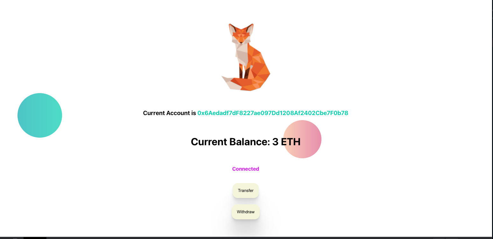

# Welcome to plain smart contract with React 😘


- [X] fetch account
- [ ] transfer (WIP but you can transfer manually within ```truffle console```)
- [ ] withdraw

before play this project you need to

- install truffle,Ganache (https://trufflesuite.com/ganache/)

to run the project

- npm install
- run Ganache and crate workspace (just follow this
  link https://trufflesuite.com/docs/ganache/workspaces/creating-workspaces.html)
- connect between your wallet and browser
  via [Metamask extension](https://chrome.google.com/webstore/detail/metamask/nkbihfbeogaeaoehlefnkodbefgpgknn)
- in Metamask click add a new network tab and follow these setting ``` new rpc url: http://127.0.0.1:7545``` and ``` chain id: 1337 ``` another fields is up to you ;)
- at root project run ``` truffle migrate --reset ```
- run ```truffle console```
- paste ``` const instance = await SCZ.deployed();```
- transfer eth from another accounts to yours to increase your current balance
  by ``` instance.addFunds({from: accounts[1], value: "3000000000000000000"}) ``` ``` 3000000000000000000 ``` is Wei
  format it's equal 3 Ether you can try to play the Wei -> Ether converter it in [this](https://eth-converter.com/)
- all of 3 steps above you need to do within ```truffle console```

if there is anything you want for this project i will create article how to set up for this project
at [Medium](https://sirawit0676.medium.com/)

enjoy kub :3 [Sirawich Voungchuy](https://github.com/SirawichDev)


